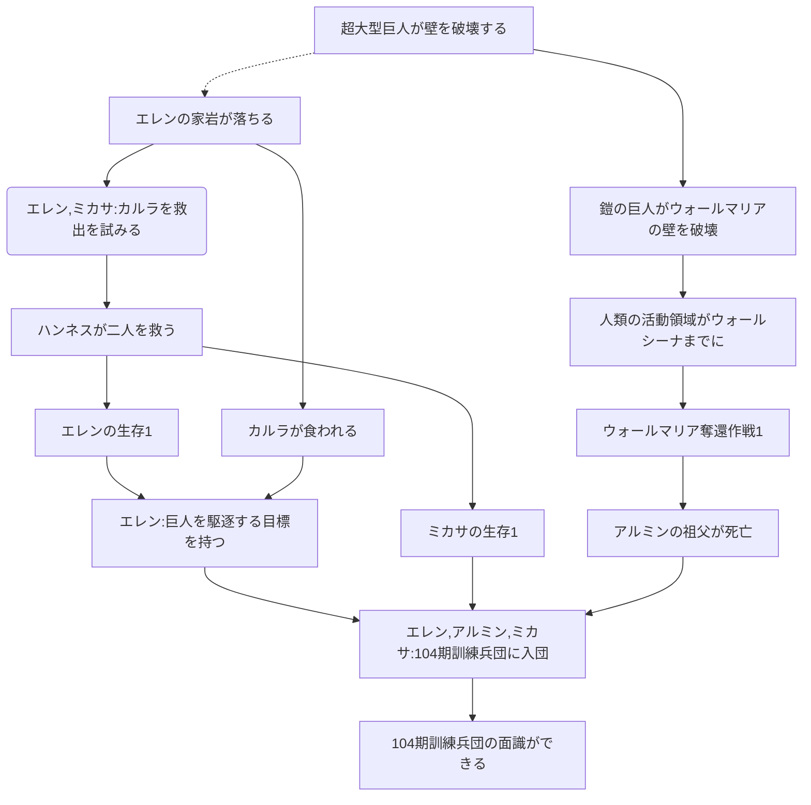

## シガンシナ陥落



## トロスト防衛・奪還戦

note

```
%%  ユミルが巨人になる-.->マルセルを食べる
%%  マルセルを食べる-->顎の巨人を継承する
%%  マルセルを食べる-->ライナー作戦を続行させる
%%  ライナー作戦を続行させる-->ベルトルトが壁を破壊する
%%  エレンとミカサでカルラを救出しようとする-->アルミンがハンネスを呼ぶ
%%  アルミンがハンネスを呼ぶ-->ハンネスが二人を救う(ハンネスが二人を救う)
```

```
EE エレン
MA ミカサ
AA アルミン
H ハンネス
KE カルラ
BF ベルトルト
RB ライナー

JK ジャン
MB マルコ
SB サシャ
CS コニー
KR クリスタ
Y ユミル
AR アニ
ES エルヴィン
RA リヴァイ
HZ ハンジ
```
