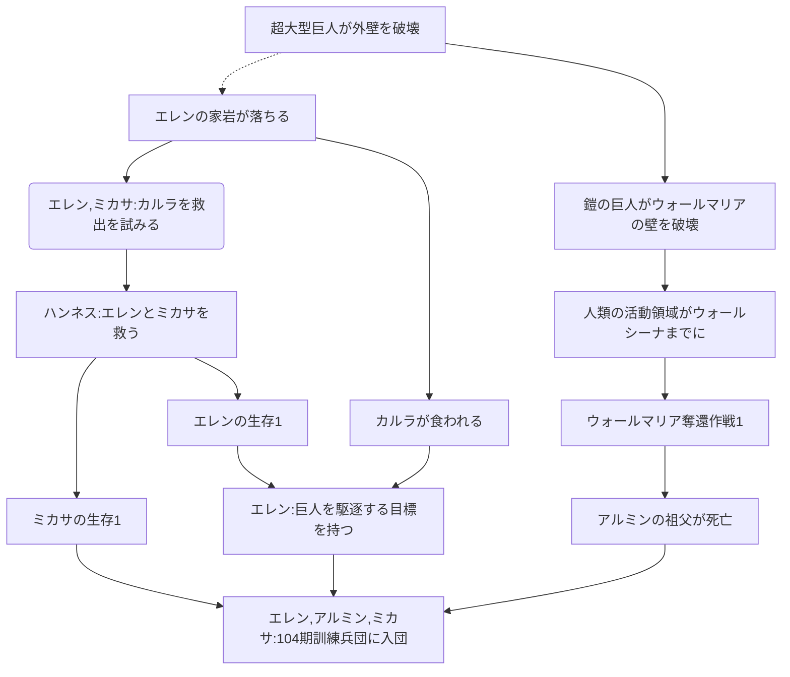
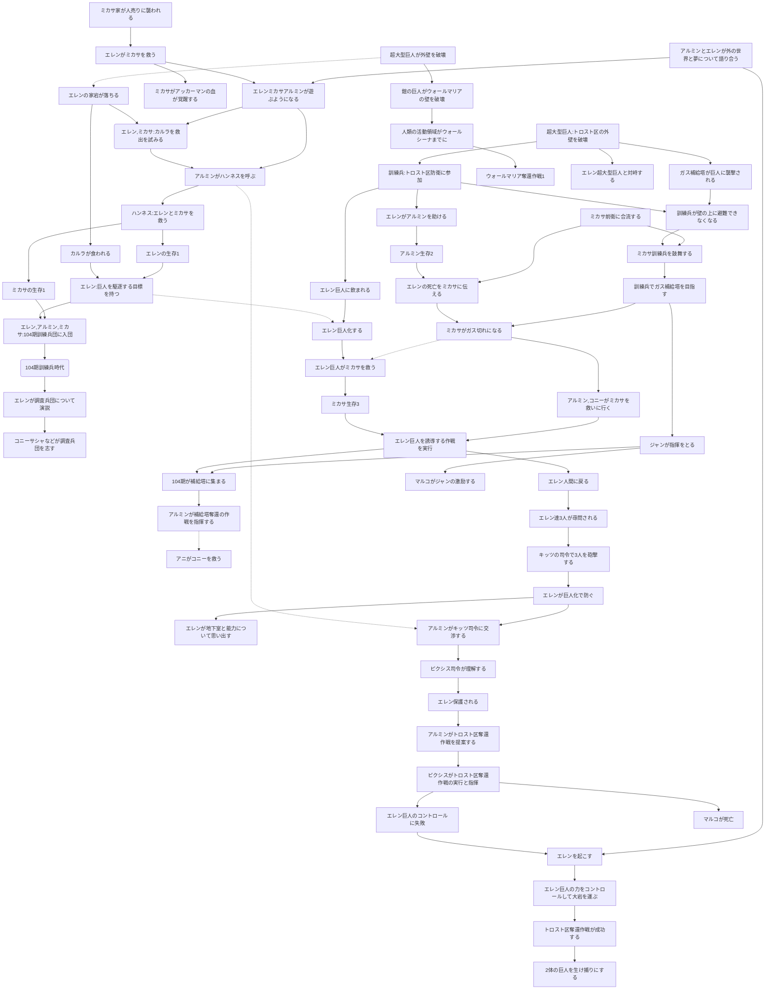
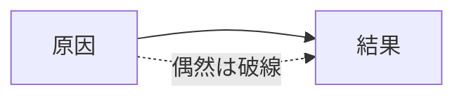

## シガンシナ陥落



## トロスト防衛・奪還戦



note

```
EE15 エレン
MA8 ミカサ
AA7 アルミン
H ハンネス
KE カルラ
BF1 ベルトルト
RB1 ライナー
MR1 マルコ

JK2 ジャン
MB マルコ
SB サシャ
CS コニー
KR クリスタ
Y ユミル
AR1 アニ
ES エルヴィン
RA リヴァイ
HZ ハンジ

PX2ピクシス
```

```
%%  ユミルが巨人になる-.->マルセルを食べる
%%  マルセルを食べる-->顎の巨人を継承する
%%  マルセルを食べる-->ライナー作戦を続行させる
%%  ライナー作戦を続行させる-->ベルトルトが壁を破壊する
%%  調査兵団のいないタイミングを狙う

%% AR1-->マルコ殺害を手伝わせる
%% ライナーアニメルトルトがエレンを目撃する-->エレン奪還作戦1
%% EE15-->ライナー達が作戦会議をする-->MR1
```

## 図形の定義


