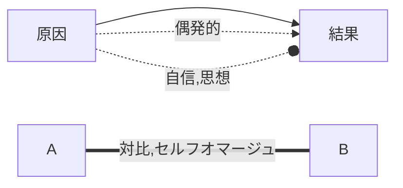

## プロット

```mermaid
graph TD;
%%	E2009[ミカサの家紋を母親から受け継ぐ]
	E2010[ミカサ家が人売りに襲われる]
	E2020[エレンがミカサを救う]
	E2030[ミカサがアッカーマンの血が覚醒]
	E2035[エレンとミカサの生存]
	E2037[ミカサがエレン家で暮らすようになる]
	E2010-->E2020-->E2030-->E2035-->E2037
%%	XAR3[アルミンの家族が冒険心が強い]-->XAR2
%%	XAR2[アルミンの両親が気球で壁を越えようとする]-->中央憲兵がアルミンの両親を殺害
%%	XAR3-->XAR1
%%	エレンがアルミンを出会う-->XAR1アルミンが外の世界の本をエレンに見せる
%%	XAR1-->E2040
	E2040[アルミンとエレンが外の世界と夢について語り合う]
	E2050[エレンミカサアルミンが遊ぶようになる]
	E2040-->E2050
	E2037-->E2050
%%	F3010[アルミン:今日壊されない保証なんてどこにも...]E3010 -->
	E3010[超大型巨人が外壁を破壊]
	E3020[エレンの家岩が落ちる]
	E2050-->E3030
	E3010-.->E3020
	E3030[エレンとミカサがカルラを救出を試みる]
	E3020-->E3030
	E3040[カルラが食われる]
	E3020-->E3040
	E3035[アルミンがハンネスを呼ぶ]
	E3060[ハンネスがエレンとミカサを救う]
	E3030-->E3035-->E3060
	E3070[エレンとミカサの生存]
	E3075[鎧の巨人がウォールマリアの壁を破壊]
	E3087[人類の活動領域がウォールシーナまで後退]
	E3010-->E3087-->E3075
	E3080[エレンが巨人を駆逐する信念を持つ]
	E3060-->E3070-->E3080
	E3040-->E3080
	E3070-->E3082[エレンがグリシャに注射を打たれる]
%%	E3070-->E3082[エレンがグリシャから始祖と進撃を継承する]
%%	E3070-->E3083[グリシャ死亡]
%%	E3082-->E3084[キースがエレンを宿舎に戻す]
	E3086[無謀なウォールマリア奪還作戦1]
	E3087[アルミンの祖父が死亡]
	E3075-->E3086-->E3090
	E3090[エレン,アルミン,ミカサが104期訓練兵団に入団]
	E3070-->E3090
	E3080-->E3090
	E3090-->E3510
	E3510([104期訓練兵時代])
%%	E3510-->E3514[キースがエレンのベルトを壊す]
%%	E3514-->E3516
	E3510-->E3516
	E3516[エレンが立体機動適正訓練に失敗する]
	E3516-->E3518[エレンとアルミンがライナーとベルトルトと面識を持つ]
	E3518-->E3519[ライナーが故郷に帰るという夢を話す]
%% <!-- 訓練兵団入団まで -->
	E3510-->E4010([104期訓練兵卒業])
	E3510-->E3620[ジャンとマルコが面識を持つ]
	E3510-->E3630[ユミルとクリスタが面識を持つ]
	E3630-->E3633[ユミルがダズを救う]
	E3633-->E3635[ダズ生存]
	E3510-->E3610[ライナーがエレンとアニの面識を作る]
	E3610-->E3612[エレンがアニの格闘術を学ぶ]
	E4010-->エレンが調査兵団について演説-->E4020[コニーサシャなどが調査兵団を志す]
	E4030[超大型巨人がトロスト区の外壁を破壊]
	E4010-->E4040
	E4030-->E4040[エレン達が超大型巨人と対峙する]
	E4040-->E4041[サシャがサムエルを救う]
%%	E4040-->E4042[超大型巨人がのろいという情報を得る]
	E4030-->E4050[訓練兵がトロスト区防衛に参加]
	E4050-->E4060[34班が壊滅する]
	E4060-->E4065[トーマスが奇行種に食われる]
	E4060-->E4067[エレンがアルミンを助ける]-->E4070[アルミン生存]
	E4070-->E4080[エレン巨人に飲まれる]
	E4090[リーブス商会が物資を運んで避難が遅れる]
	E4100[ミカサがリーブスに話をつける]
	E4110[ミカサがイルーゼを救う]
	E4030-->E4090-->E4100-->E4110
	E4120[ミカサが前衛に合流する]
	E4070-->E4138[アルミンがエレンの死亡をミカサに伝える]
	E4080-->E4130[エレン巨人化する]
	E3080-.-oE4130
	E4035[ガス補給塔が巨人に襲撃される]
	E4036[兵士が壁の上に撤退できなくなる]
	E4030-->E4035-->E4036
	E4140[ミカサ訓練兵を鼓舞する]
	E4150[訓練兵でガス補給塔を目指す]
	E4160[ミカサがガス切れになる]
	E4170[アルミン,コニーがミカサを救いに行く]
	E4120-->E4140
	E4036-->E4140-->E4150-->E4160
	E4138-->E4160
	E4160-->E4170
	E4180[エレン巨人がミカサを救う]
	E4190[ミカサ生存]
	E4200[ジャンが指揮をとる]
	E4210[104期が補給塔に集まる]
	E4150-->E4200
	E4160-.->E4180
	E4130-->E4180
	E4180-->E4190
	E4170-->E4220[エレン巨人を誘導する作戦を実行]
	E4190-->E4220
	E4220-->E4210
	E4200-->E4210
	E3620-->E4205
	E4200-->E4205[マルコがジャンを激励する]
	E4210-->E4230[補給塔奪還作戦]-.->E4240[アニがコニーを救う]
	E4065-->E4220
	E4220-->E4235[エレン巨人がトーマスを食べた巨人を見つけ暴れる]
	E4235-->E4245[エレン人間に戻る]
%%	E4245-->E4246[ライナーとアニがエレンが9つの巨人だと知る]
%%	E4230-->E4246
	E4245-->E4250[エレンが保護される]
	E4230-->E4250
	E4250-->E4260[エレン達3人が尋問される]
	E4262[キッツの司令で3人を砲撃する]
	E4264[エレンが巨人化で防ぐ]
	E4266[エレンが地下室と能力について思い出す]
	E4260-->E4262-->E4264
	E4264-->E4270[アルミンがキッツに交渉する]
	E4264-->E4266
	E3035-.-oE4270
	E4270-->E4275[ピクシス司令が理解する]-->E4280[エレン保護される]
	E4290[アルミンがトロスト区奪還作戦を考案する]
	E4300[ピクシスがトロスト区奪還作戦の実行と指揮]
	E4280-->E4290-->E4300
	E4310[エレン巨人のコントロールに失敗]
	E4300-->E4310
	E4312[リコが作戦問題ありの信号を送る]
	E4310-->E4312
	E4312-->E4314[アルミンがエレンのもとに移動]
	E4315[イアンが作戦続行]
	E4310-->E4315
	E4320[エレンを起こす]
	E4330[エレン巨人の力をコントロールして大岩を運ぶ]
	E4338[調査兵団が帰還する]
	E4340[リヴァイが援護する]
%% ライナーがマルコを食べた巨人を殺害する-->E4458
	E4338-->E4340
	E4330-->E4340
	E4314-->E4320
	E4315-->E4320
	E2040-->E4320
	E4340[エレンが大岩で穴を塞ぐ]
	E4320-->E4330
	E4340-->E4342([トロスト区奪還作戦が成功する])
	E4350[2体の巨人を生け捕りにする]
	E4458[ジャンがマルコの死体を発見する]
	E4300-->E4360[マルコが死亡]
	E4340-->E4350
	E4400[エレンが収監される]
%%	<!-- トロスト区奪還まで -->
	E4410[牢屋で調査兵団がエレンと接触する]
	E4420[エレンの裁判が行われる]
	E4430[調査兵団の案が採用される]
	E4440[エレンがリヴァイ班と行動する]
	E4340-->E4400-->E4410-->E4420-->E4430-->E4440
	E4350-->E4450
	E4450[生け捕りの巨人が殺害される]
	E4452[エルヴィンが知性巨人が潜伏してる可能性に気づき作戦を立てる]
	E4450-->E4452
	E4266-->E4452
	E4455[エルヴィンがエレン達に問いかける]
	E4452-->E4455
	E4460[ジャンが調査兵団を志す]
	E4458-->E4460
	E4205-->E4460
	E4360-->E4460
	E4470[立体機動装置の検査がされる]
	E4480[アニとアルミンとコニーが会話する]
	E4450-->E4470-->E4480
	E4480-->E4485[アルミンがアニの立体機動装置がマルコのだと気づく]
	E4500([希望兵団の選択])
	E4342-->E4500
	E4500-->E4510[アニが憲兵団に入る]
%% E4246-->E4521
	E4500-->E4521[ライナー,ベルトルトが調査兵団に入団する]
	E4500-->E4520[ユミル,クリスタが調査兵団に入団する]
	E4500-->E4522[ジャン,コニー,サシャが調査兵団に入団する]
	E4020-->E4522
	E4460-->E4522
	E4020-->E4460
	E4501[エレンの実験が行われる]
	E4511[エレンがリヴァイ班との信頼関係を築く]
	E4440-->E4501-->E4511
	E4600([第57回壁外調査が行われる])
	E4452-->E4600
%% E4600-->E4602[ライナーとベルトルトにエレンが右翼前方にいる配置図が渡される]
%% E4603-->E4604[アニが右翼前方から攻撃を始める]-->E4610
	E4608[右翼側から大量の巨人と女型の巨人が現れる]
	E4608-->E4610[右翼側が壊滅する]
	E4620[女型の巨人がアルミンを襲撃する]
	E4624[アルミン落馬してフードを被る]
	E4625[女型の巨人がアルミンの顔を確認して見逃す]
	E4630[アルミン生存]
	E4625-->E4626[女型が知性巨人で人を探していると気づく]
	E4600-->E4610-.->E4620-->E4624-->E4625-->E4630
	E4640[アルミン,ジャン,ライナーと合流する]
	E4521-->E4640
	E4522-->E4640
	E4649[ライナーがアルミンにエレンの位置はどこか聞く]
	E4650[アルミンがエレンの位置や敵の目的の推測を話す]
%%	E4651[アルミンが敵の目的はエレンを攫うことだと推測する]
	E4660[女型足止めを実行する]
	E4630-->E4640-->E4650-->E4660
	E4626-->E4650
	E4205-.->E4660
	E4690[女型がジャンにとどめを刺そうする]
	E4695[アルミンが104期しか知らない言葉でエレンが死んだと嘘をつく]
	E4700[アニの動きが止まる]
	E4730[ライナーが女型に攻撃し補足される]
	E4740[ライナーが脱出する]
	E4750[女型が中央前方に向かい移動する]
	E4660-->E4690-->E4695-->E4700
	E4700-->E4730-->E4740-->E4750
	E4700-->E4720[ジャン生存]
	E4760[女型がリヴァイ班に接触する]
	E4770[エレンが進むことを選択する]
	E4780[女型がトラップで拘束される]
	E4750-->E4760-->E4770-->E4780
	E4452-->E4780
	E4780[女型がトラップで拘束される]
	E4780-->E4790[女型が無垢の巨人を集めて脱出する]
	E4790-->E4800[女型がリヴァイ班を襲う]
	E4800-->E4810[女型によりグンタ死亡]
	E4800-->E4820[エレンがリヴァイ班を信じて退避する]
	E4820-->E4830[女型によりエルドペトラオルロ死亡]
	E4830-->E4840[エレンが女型と戦闘する]
	E4840-->E4850[エレンが女型に捕獲される]
	E4850-->E4860[ミカサが女型と戦闘する]
	E4860-->E4870[リヴァイがミカサに合流する]
	E4870-->E4880[リヴァイとミカサが女型と戦闘する]
	E4880-->E4890[リヴァイが足を負傷する]
	E4880-->E4900[エレンを奪還する]
	E4608-->E4910
	E4900-->E4910[エレンを憲兵への引き渡しが決まる]
	E4510-->E4912[アニがマルコとヒッチと面識を持つ]
	E4912-->E4914[マルコがエレンについて知る]
	E4485-->E4920
	E4700-->E4920
	E4920[アルミンがアニが女型だと気づく]
	E4920-->E4930
	E4910-->E4930[調査兵団が女型捕獲作戦を立てる]
	E4910-->E4940
	E4930-->E4940[ストヘス区でアニを追い詰める]
	E4940-->E4950[アニが巨人化する]
	E4720-->E4960
	E4950-->E4960[アニと調査兵団の戦闘]
	E4960-->E4965[エレンがアニを食べようとする]
	E4965-->E4966[リヴァイがエレンを止める]
	E4966-->E4970[アニが結晶化する]
	E4960-->E4980[壁の中に巨人が眠っていると発覚する]
%%	<!-- アニ捕獲まで -->
	E4980-->E4990[ニックとハンジが面識を持つ]
	E4930-->E5000[新兵を武装解除して隔離する]
	E5005[ウォールローゼ南西から巨人が複数現れる]
	E5005-->E5010
	E5000-->E5010[待機していた村が襲われる]
	E5010-->E5020[装備せずに避難する]
	E5020-->E5025[ミケが足止めをする]
	E5025-->E5030[獣の巨人によりミケが死亡]
	E5025-->E5032[立体機動装置を奪われる]
	E5020-->E5040[ラガコ村で動けない巨人を発見する]
	E5020-->E5050[サシャがカヤを救う]
	E5050-->E5052[カヤ生存]
	E5052-->E5054[サシャが事後報告に向かう]
	E5025-->E5060[ウトガルド城に避難する]
	E4991[アルミンが夜間進行を提案する]
	E4990-->E4992[ニックがクリスタの監視について情報を出す]
%% OVAと対比
	E4992-->E4993[ミカサがクリスタの説明でユミルという名前を出しハンジが認知する]
	E5060-->E5062[ユミルがライナーに怪しまれる]
	E5060-->E5070[夜に活動する巨人と獣の巨人に襲撃される]
	E5060-->E5077[ライナーがコニーを助けて怪我を負う]
	E5077-->E5080[コニー生存]
	E5060-->E5090[ナナバゲルガー死亡]
	E3630-->E5100
	E5090-->E5100[ユミルが巨人になる]
	E5054-->E5056[サシャがハンジに資料を伝達する]
	E5056-->E5058[ハンジやアルミン達がアニ以外の知性巨人の潜伏について話し合う]
	E4649-->E5064
	E4750-->E5064
	E5058-->E5064[ライナーとベルトルトにあたりをつけ警戒する]
	E5064-->E4996
	E4992-->E4996[ハンジ,104期がウトガルドに向かう]
%%	E5130E5130 -->
	E4996-->E5130[ハンジ達とウトガルド組が合流する]
	E5100-->E5110[ウトガルド104期組生存]
%% E511A[リヴァイがエレンを救う]--E511B[ミカサがクリスタを救う]
	E5130-->E5120[ユミルが保護される]
	E5130-->E5110
	E5130-->E5140[壁の上に避難する]
%%	E514A[E4270]---E5141[クリスタがユミルは敵でないとハンジに説得する]
	E5130-->E5150
	E5064-->E5121
	E3519-->E5121
	E5140-->E5121[エレンがライナーとベルトルトに故郷の話題を出す]
	E5120-->E5150
	E5121-->E5150[ベルトルトがライナーに故郷へ帰れると伝える]
	E5150-->E5160
	E5077-->E5160[ライナーがエレンに正体を暴露する]
	E5160-->E5170[ライナーとベルトルトが巨人化しエレンの奪還を開始する]
	E5120-->E5175
	E5170-->E5175[ベルトがユミルと立体機動装置を1つ確保する]
	E3612-->E5180
	E5170-->E5180[エレンがライナーを追い詰める]
	E5180-->E5190[ベルトルトがエレンを襲撃する]
	E5190-->E5200[ライナーとベルトルトがエレンとユミルを捕獲して壁の外側へ逃げる]
	E5110-->E5210
	E5200-->E5210[エレン奪還へ向かう]
```



```
%%  ユミルが巨人になる-.->マルセルを食べる
%%  マルセルを食べる-->顎の巨人を継承する
%%  マルセルを食べる-->ライナー作戦を続行させる
%%  ライナー作戦を続行させる-->ベルトルトが壁を破壊する
%%  調査兵団のいないタイミングを狙う

%% AR1-->マルコ殺害を手伝わせる
%% ライナーアニメルトルトがエレンを目撃する-->エレン奪還作戦1
%% EE15-->ライナー達が作戦会議をする-->MR1
```

## 図形の定義


